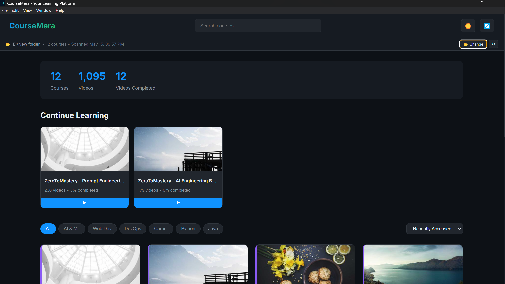
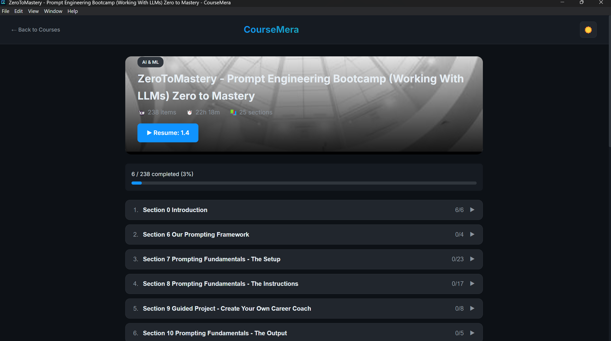
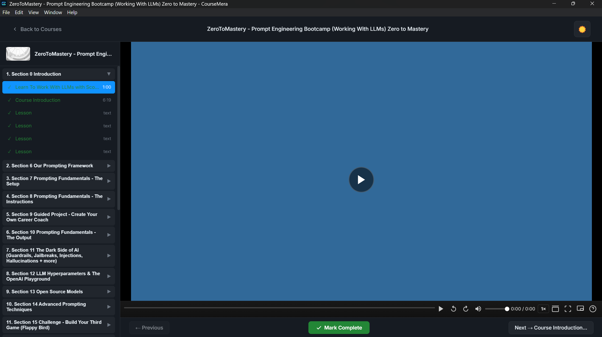

# CourseMera


> **A beautiful, privacy-first desktop learning platform for your video courses.**  
> Transform any folder of videos into a Netflix-like learning experience with zero configuration.

## Why CourseMera?

Unlike cloud-based platforms that require subscriptions, uploads, and compromise your privacy, CourseMera puts you in complete control:

| Feature | CourseMera | Cloud Platforms (Udemy, Coursera) | Local Video Players |
|---------|------------|-----------------------------------|---------------------|
| **Privacy** | ✅ 100% local - no data leaves your computer | ❌ Tracks viewing habits, requires account | ✅ Local but poor UX |
| **Cost** | ✅ Free & open source | ❌ Subscription required | ✅ Free but limited |
| **Setup** | ✅ Point to folder - done in 10 seconds | ❌ Upload/course creation workflow | ❌ Manual file management |
| **Features** | ✅ Progress tracking, categories, search | ✅ Professional but locked-in | ❌ Basic playback only |
| **Portability** | ✅ Works offline, move folders freely | ❌ Requires constant internet | ✅ Portable but disorganized |
| **Customization** | ✅ Themes, keyboard shortcuts, theater mode | ❌ Fixed UI/UX | ❌ Minimal options |

## Features

🎯 **Smart Course Detection** - Automatically scans folders for MP4/WebM videos and HTML lessons  
📊 **Beautiful Dashboard** - View stats, continue learning, and browse by category at a glance  
🎥 **YouTube-Style Player** - Theater mode, playback speed, picture-in-picture, and keyboard shortcuts  
📈 **Progress Tracking** - Never lose your place with automatic resume and completion tracking  
🏷️ **Category Organization** - Auto-detect or manually organize courses by topic  
🌓 **Dark/Light Themes** - Easy on the eyes for any lighting condition  
⚡ **Lightning Fast** - Native Electron performance with zero lag  
🔐 **100% Private** - Zero telemetry, zero data collection, works completely offline  
💻 **Cross-Platform** - Windows, macOS, and Linux support  
⌨️ **Power User Friendly** - Comprehensive keyboard shortcuts for efficient navigation  

## Screenshots

<div align="center">
  
  
  
</div>

*Left: Dashboard with search, stats, and continue learning | Middle: Course syllabus with progress tracking | Right: Immersive video player with navigation*

## Demo

Watch CourseMera in action:

<video width="800" loop autoplay muted playsinline>
  
</video>
*See how to select your folder, browse courses, and use the video player*

## Installation

### 🚀 One-Click Installation (Recommended)

Download the latest version for your operating system from the [Releases Page](https://github.com/zetroretron/coursemera/releases/latest):

- **Windows**: `CourseMera-Setup-[version].exe` (NSIS installer with Start Menu shortcut)
- **macOS**: `CourseMera-[version].dmg` (drag & drop installation)
- **Linux**: `CourseMera-[version].AppImage` (executable, no installation needed)

### 🛠️ From Source (For Developers)

```bash
# Clone the repository
git clone https://github.com/zetroretron/coursemera.git
cd coursemera-desktop

# Install dependencies
npm install

# Run in development mode
npm run dev

# Build for your platform
npm run build:win   # Windows
npm run build:mac   # macOS  
npm run build:linux # Linux
```

## Usage Guide

1. **Launch CourseMera** from your applications menu or desktop shortcut
2. **Select your courses folder** by clicking "Select Courses Folder" or using File → Select Folder
3. **Wait for scanning** to complete (usually seconds for typical collections)
4. **Explore your courses**:
   - Dashboard shows stats and continue learning section
   - Browse by category or use search to find specific content
   - Click any course to see its structure and progress
5. **Learn effectively**:
   - Double-click a video to open the immersive player
   - Use theater mode (T) or picture-in-picture (I) for multitasking
   - Mark lessons as complete to track your progress
   - Use keyboard shortcuts for efficient navigation (see below)

### Keyboard Shortcuts

| Shortcut | Action |
|----------|--------|
| `Space` / `K` | Play/Pause |
| `J` | Rewind 10 seconds |
| `L` | Forward 10 seconds |
| `←` / `→` | Seek ±5 seconds |
| `↑` / `↓` | Volume control |
| `M` | Mute/unmute |
| `F` | Toggle fullscreen |
| `T` | Toggle theater mode |
| `I` | Toggle picture-in-picture |
| `<` / `>` | Decrease/increase playback speed |
| `0-9` | Jump to 0%-90% position |
| `?` | Show/hide help overlay |

## 🗺️ Roadmap

### Q3 2026
- [ ] Subtitle support (SRT, VTT)
- [ ] Playlist/course sequencing
- [ ] Enhanced metadata extraction (duration, resolution, codecs)
- [ ] Batch import/export of course progress

### Q4 2026
- [ ] Course recommendations based on viewing history
- [ ] Note-taking system within lessons
- [ ] Achievement/badge system for motivation
- [ ] Multiple profile support

### 2027+
- [ ] Mobile companion apps (iOS/Android)
- [ ] Cloud sync option (self-hosted)
- [ ] Plugin architecture for extensibility
- [ ] Live streaming/local network sharing

## Contributing

We love contributions! CourseMera is open source under the MIT license.

### Getting Started
1. Fork the repository
2. Create your feature branch: `git checkout -b feature/amazing-feature`
3. Make your changes
4. Ensure all tests pass and linting is clean
5. Submit a pull request

### Development Setup
```bash
git clone https://github.com/your-username/coursemera.git
cd coursemera-desktop
npm install
npm run dev
```

### Code Style
- Follow existing JavaScript/ESLint conventions
- Keep functions small and focused
- Add comments for complex logic
- Update documentation when changing behavior

### Reporting Issues
Please use the issue template when reporting bugs or suggesting features. Include:
- Your operating system and version
- Steps to reproduce the issue
- Expected vs actual behavior
- Screenshots or screen recordings when applicable

## License

Copyright © 2026 CourseMera. Licensed under the [MIT License](LICENSE).

This is free and open source software. You are welcome to:
- Use it for personal or commercial purposes
- Modify it to suit your needs
- Share improvements with the community

While attribution is not required, we appreciate links back to the original repository.

---

*Built with ❤️ by open source contributors. Powered by Electron, Express, and community feedback.*
